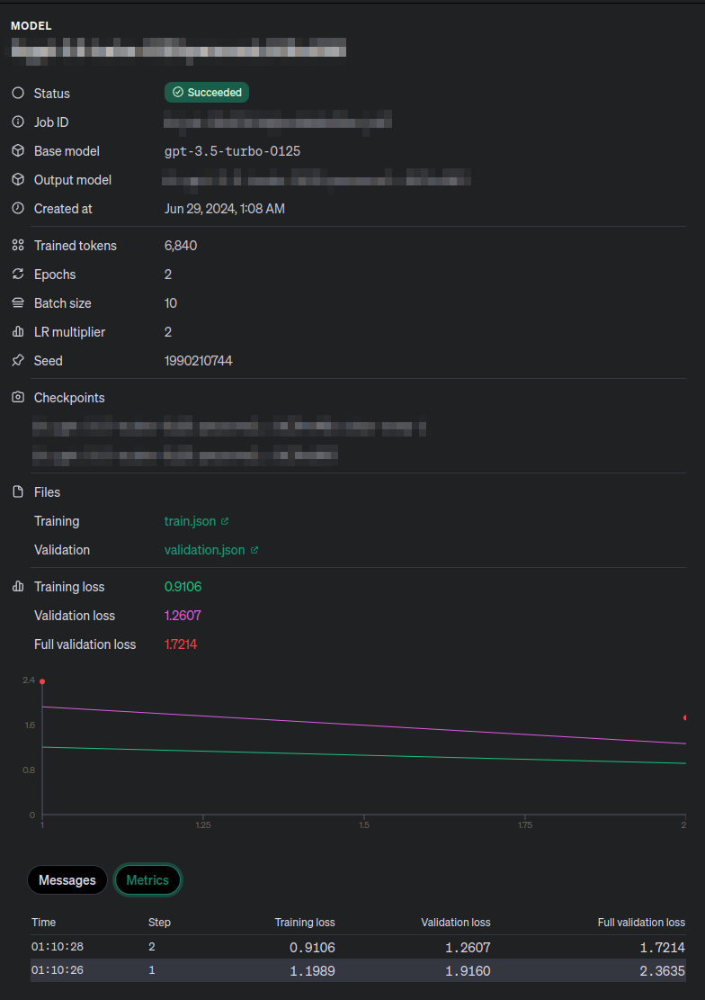

## About

This is a project that shows how to fine tune OpenAI's `gpt-3.5-turbo` model on a custom dataset. The dataset used in this project is a collection of a few news articles. The model is fine-tuned on this dataset to classify the news articles as important or not important. For this project, important news articles are those that are related to the COVID-19 pandemic.

## Dataset

The example dataset only contains a few news articles. The CSV file is located [here](./data/news.csv). Following are the columns in the dataset:

- `id`: The unique identifier of the news article.
- `title`: The title of the news article.
- `subtitle`: The subtitle of the news article.
- `text`: The text of the news article.
- `journal`: The journal that published the news article.
- `important`: The label of the news article. It is `1` if the news article is important and `0` otherwise.

One example from the dataset will be used as a validation dataset, and the rest will be used for training. In a production environment, you should use a larger dataset. Check OpenAI's [fine-tuning guide](https://platform.openai.com/docs/guides/fine-tuning/preparing-your-dataset) for more information.

## Fine-tuning

Here is a documentation of the codebase.

### Transform the dataset

First, the dataset is transformed into a format that can be used for fine-tuning the model. The [transform_dataset.py](./src/transform_dataset.py) script is used for this purpose. The script reads the CSV file and creates a JSON file that contains the training and validation datasets.

Here is how you can run the script:

```bash
python src/transform_dataset.py
```

### Fine-tune the model

The script [fine_tune.py](./src/fine_tune.py) fine-tunes the model on the transformed dataset. The script uses the `gpt-3.5-turbo` model from OpenAI's API.

Here is how you can run the script:

```bash
python src/fine_tune.py
```

The script outputs should look like this:

```text
Train file: <file_id>
Validation file: <file_id>
Job status: validating_files
Job status: running
Job status: running
Fine tuning completed. Model: <fine_tuned_model_id>
```

In OpenAI's dashboard, the fine-tuned model you can see more details about the fine-tuned model, as shown below:

[](./doc/fine-tuned-model.png)

## Usage

Once the model is fine-tuned, you can use it to classify news articles as important or not important. The following code shows how you can use the fine-tuned model to classify news articles:

```python
from openai import OpenAI

MODEL_ID = "<fine_tuned_model_id>"
OPENAI_CLIENT = OpenAI()

def classify_news(text: str) -> str | None:
    completion = OPENAI_CLIENT.chat.completions.create(
        model=MODEL_ID,
        messages=[
            {
                "role": "system",
                "content": "You are a system that understands news that are important. If the news is important, classify it as 'important'. Otherwise, classify it as 'not important'. To classify the news, you should consider the core of the news, or what it really means. You should not use other classifications. Otherwise, the answer will be considered invalid.",
            },
            {"role": "user", "content": text},
        ],
    )
    return completion.choices[0].message.content
```

You can use the `classify_news` function to classify news articles. Here is an example:

```python
text = "The COVID-19 pandemic has caused a lot of deaths and economic losses."
classification = classify_news(text)
print(classification)
```

The output should be `important` or `not important`. Make sure the provided prompt is clear and concise for your use case. If the prompt is not clear, the model might not give the correct classification or might give an answer that includes more information than needed.
